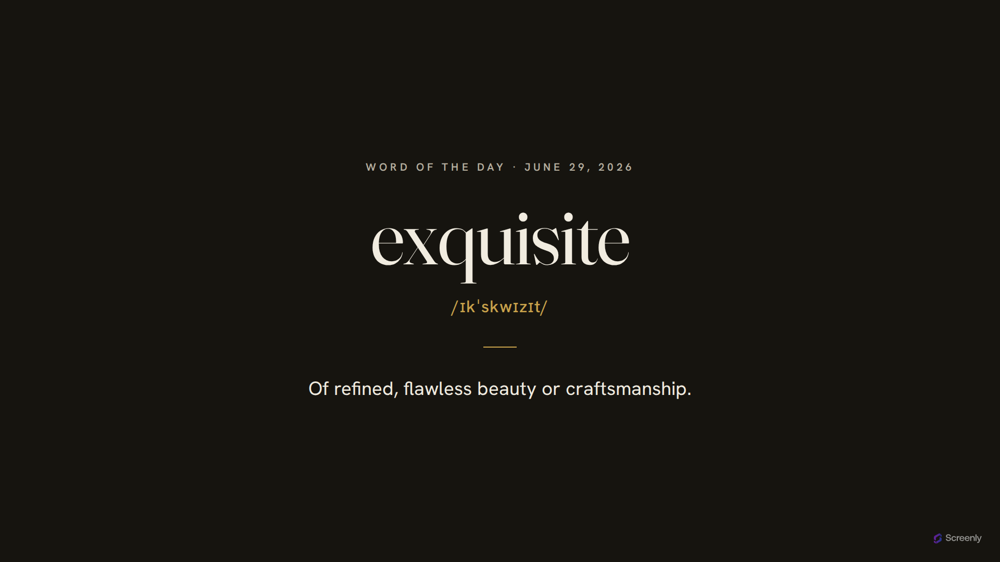

# word-of-the-day

A full-screen **word of the day** for Screenly digital signage — one word, its
pronunciation, and its meaning, presented like the opening of a dictionary entry
and chosen fresh each day.

**Live:** https://word.srly.io



The word is selected **deterministically by the calendar date**, so every screen
shows the same word on a given day and it advances at local midnight — it does
not rotate or change on reload. A curated set of ~364 interesting-but-usable
words (one for roughly every day of the year) is baked into the site, so it has
no runtime dependencies and works offline on signage.

It's a static site hosted on GitHub Pages — part of the Screenly signage family
alongside [weather-app](../weather-app), [clock-app](../clock-app), and
[quotes](../quotes), sharing their typography and palette.

## Stack

- **Static `index.html`** — no server runtime.
- **TypeScript** (strict), bundled to browser JS by **Bun**.
- **Tailwind CSS v4** (CSS-first config), compiled by the Tailwind CLI.
- Self-hosted **Fraunces** (display) + **Hanken Grotesk** (text) variable fonts.
- **Biome** for lint/format; **bun:test** for tests.

## Develop

Requires [Bun](https://bun.sh). All package management is via Bun — no npm/npx.

```bash
bun install
bun run dev        # build into ./dist and serve it locally
```

Other commands:

```bash
bun run typecheck  # tsc --noEmit (strict)
bun run lint       # biome lint --error-on-warnings
bun test           # helper determinism + words.json validation
bun run build      # build the static site into ./dist
```

## Deploy

Pushing to `master` runs `.github/workflows/deploy-pages.yml`, which builds the
site and deploys `./dist` to GitHub Pages. PRs run `ci.yml` (typecheck, lint,
test, build).

First-time setup (one-off, outside this repo):

- **DNS:** add a CNAME record `word.srly.io → screenly-labs.github.io`.
- **Repo → Settings → Pages:** set Source to "GitHub Actions"; set the custom
  domain to `word.srly.io`; enable "Enforce HTTPS" once the certificate provisions.

## Data

`assets/static/data/words.json` is an array of `{ word, pronunciation, definition }`.
The list is hand-curated and work-appropriate; pronunciations use General
American IPA. See [CLAUDE.md](CLAUDE.md) for the curation and selection details.

## License

[AGPL-3.0-only](LICENSE).
